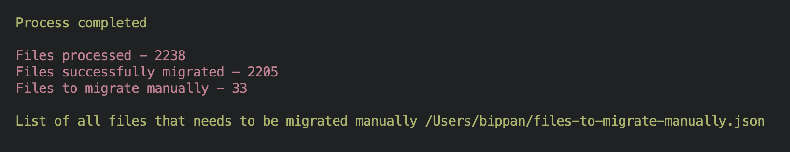

# vue-migration

This library was build to convert vue 2 options api syntax to vue 3 syntax. 

This does not transform template code. This works only for vue 2 syntax on script tag. 

Installation
```
npm install -g vue-migration
```

### Usage

--projectLocation -  takes location of your project or location of vue file it needs to convert.

-- transformFolder - takes location of folder where you want to keep your new transformed vue files. This will not change the orignal vue files.
```
// adding folder
vue-migration --projectLocation="/projectLocation" --transformFolder="/transformFolder"

// adding vue file location
vue-migration --projectLocation="/projectLocation/test.vue" --transformFolder="/transformFolder"
```

If you want to change orignal files you can add --dryRun=false.
```
// To change the main files pass --dryRun=false
vue-migration --projectLocation="" --dryRun=false
```

At the end of transformation it will show result for the number of files that are processed,number of  files successfully transformed and number files that needs to be transformed manually.

For all the files which were not transformed you will get a location to 'files-to-migrate-manually.json' this json has list of all files which are not transformed and for such files migration to new code needs to be done manually.



## Does it convert all the code to the latest syntax?

vue-migration tries to convert most of the code that is necessary reducing manual efforts spend by devs to update to latest stack.

props, watch, data(), computed, emits, lifecychooks, $refs, $router, $route, $device, layout(nuxt 2) are converted to new vue 3 composition api syntax.

mapActions, mapState, mapGetters used with vuex are converted to pinia import syntax.

## Example 
File converted by vue-migration from vue 2 syntaxt to new vue 3 composition syntax.

Vue 2 syntax
```
<template>
    <div>vue-migration</div>
</template>
<script>
import { mapGetters, mapActions, mapState } from 'vuex';
export default {
    name: 'VueMigration',
    props: {
        name: 'vue-migration',
    },
    data() {
        return {
            description: "upgrade from vue 2 to vue 3"
        }
    },
    computed: {
        ...mapGetters('user', {
            isDeveloper: 'isDeveloper'
        }),
        ...mapGetters({
            isManager: 'user/isManager'
        }),
        nameAndDescription() {
            return this.name + "" + this.description
        }
    },
    watch: {
        description(newValue, oldValue) {
            this.onDescriptionChange()
        }
    },
    mounted() {
        const response = this.$axios.$get('/user')
        console.log('component mounted')
        this.$once('hook:beforDestroy', () => {
        });
    },
    destroyed() {
        console.log('component destroyed')
    },
    methods: {
        ...mapActions('developer', ['addDeveloper']),
        ...mapActions({
            createNewUser: "user/addNewUser",
        }),
        onDescriptionChange() {
            const devName = this.$store.getters['user/devName']
            console.log('decription is changed')
            this.$store.dispatch('dev/onDescriptionChangeByDev', { developerName: devName })
        },
        onRedirect() {
            const devName = this.$store.getters['user/devName']
            this.$emit('on-redirect', { devName })
            this.$router.push('https://vuejs.org/')
        }
    },
}
</script>
```

New vue 3 syntax
```
<template>
    <div>vue-migration</div>
</template>
<script setup>
import { storeToRefs } from 'pinia'
import { useUserStore } from '~/store/user'
import { useDeveloperStore } from '~/store/developer'
import { useDevStore } from '~/store/dev'


// #region emits
const emit = defineEmits(["on-redirect"])
// #endregion emits


// #region props
const props = defineProps({
    name: 'vue-migration',
})
// #endregion props


// #region nuxt properties
const router = useRouter();

// #endregion nuxt properties

// #region pinia state, getters and actions
const developerStore = useDeveloperStore()
const userStore = useUserStore()
const devStore = useDevStore()
const { isDeveloper, isManager, devName } = storeToRefs(userStore)
const { addDeveloper } = developerStore
const { addNewUser: createNewUser } = userStore
const { onDescriptionChangeByDev } = devStore

// #endregion pinia state, getters and actions

// #region component data
const description = ref("upgrade from vue 2 to vue 3");

// #endregion component data


// #region computed properties
const nameAndDescription = computed(() => {
    return props.name + "" + description.value;
})

// #endregion computed properties


// #region watch
watch(description, (newValue, oldValue) => {
    onDescriptionChange()
})

// #endregion watch


// #region methods
const onDescriptionChange = () => {
    const devName = devName.value
    console.log('decription is changed')
    onDescriptionChangeByDev({ developerName: devName });
}
const onRedirect = () => {
    const devName = devName.value
    emit('on-redirect', { devName })
    router.push('https://vuejs.org/')
}

// #endregion methods


// #region lifecycle hooks
onMounted(() => {
    const response = // TODO Change axios call
        // this.$axios.$get('/user')
        console.log('component mounted')
    // TODO Need to migrate manually
    // this.$once('hook:beforDestroy', () => {
    // });
})
onDestroyed(() => {
    console.log('component destroyed')
})

// #endregion lifecycle hooks

</script>
```

There is some syntax in vue files that needs to be changed manually. Added a TODO on such places.

```
// #region lifecycle hooks
onMounted(() => {
    const response = // TODO Change axios call
        // this.$axios.$get('/user')
        console.log('component mounted')
    // TODO Need to migrate manually
    // this.$once('hook:beforDestroy', () => {
    // });
})
onDestroyed(() => {
    console.log('component destroyed')
})
```


